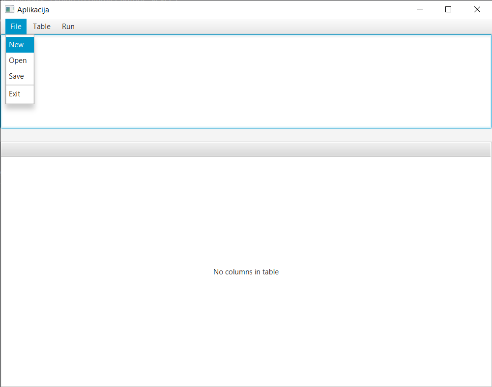
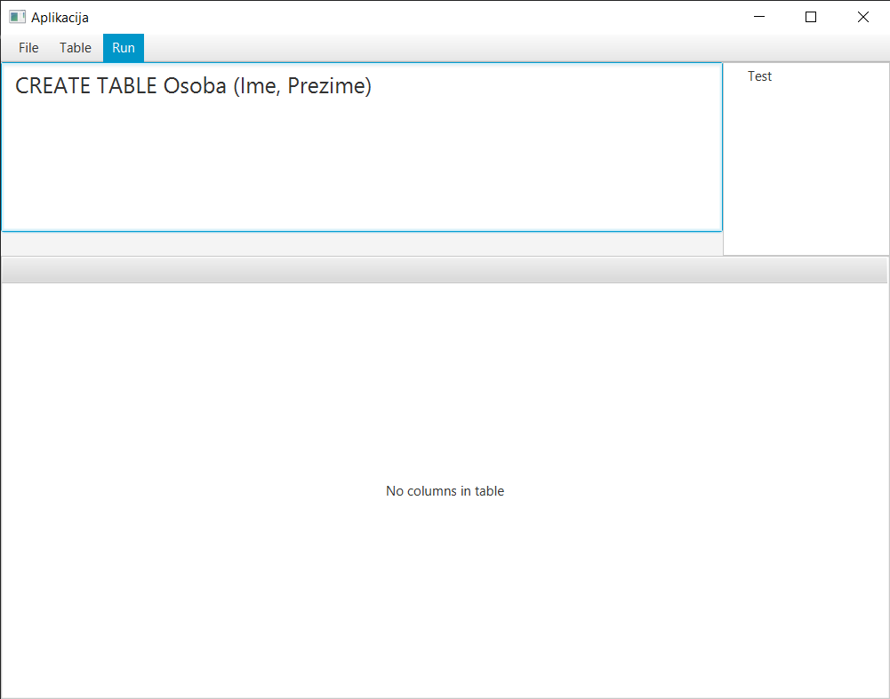
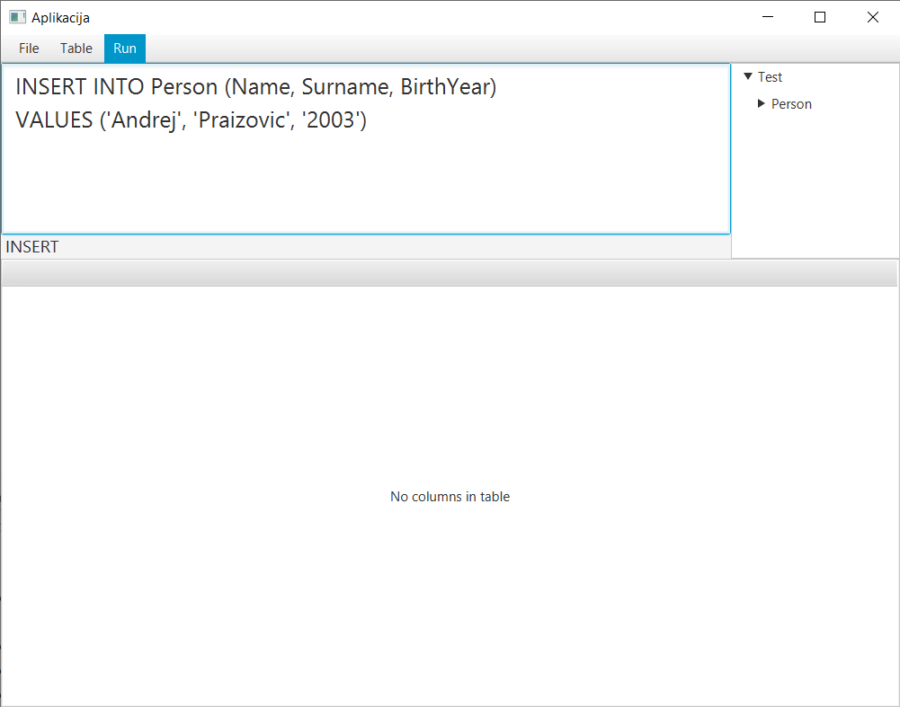
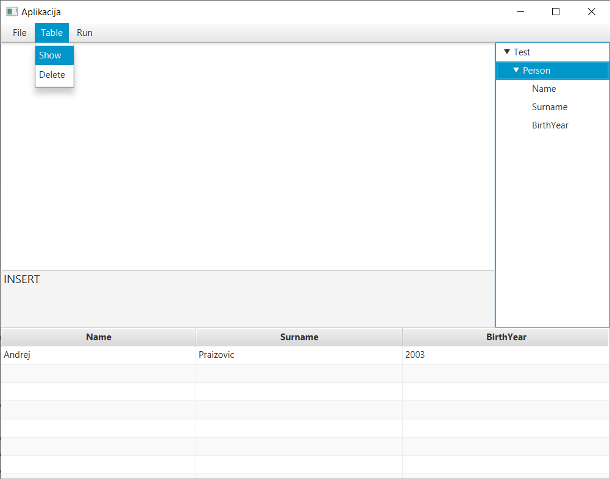
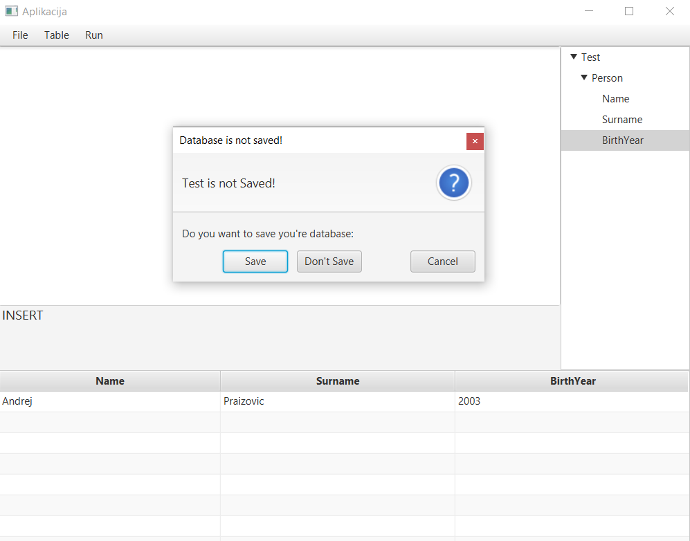

📑 Table of Contents

- [Features](#features)
  - Native C Backend (JNI)
  - Graphical Database Explorer
  - Import / Export
  -  Execute SQL Queries
  -  Edit & Search Data
- [Architecture Overview](#architecture)
- [Related Repositories](#releted-repositories)
- [Prerequisites](#prerequisites)
- [Usage](#usage)

---

## ✨ Features 

## 🧩 Native C Backend (JNI)

This application interfaces with a custom C backend through the Java Native Interface (JNI).\
The backend performs:
  - Low-level database access
  - Execution of core data operations
  - Parsing and handling of a custom database format
  - Efficient data loading/saving
    
 Note: *The backend must be compiled separately and made available as a native library (.dll, .so, .dylib).*

---

## 🔍 Graphical Database Explorer

Browse table structures through an intuitive GUI\
View rows and metadata\
Navigate large datasets easily

---

## 💾 Import / Export

Supports two formats:
  - Standard SQL (.sql)
  - Custom binary format handled by the backend

---

## ⚙️ Execute SQL Queries

- Run SQL queries directly in the GUI
- View results in a clean table layout
- Modify, add, or remove data using SQL

---

## 🧱 Architecture Overview 

This project is structured into two independent repositories, each responsible for a separate layer:

1. Backend — C + JNI
  - Database parsing
  - Query execution
  - Custom format reading/writing
  - High-performance data handling

Repository:
👉 https://github.com/kekec3/SQL-DataTool

2. Frontend — Java GUI (This Repository)
  - Provides GUI
  - Routes operations to backend through JNI
  - Displays table data, query results, and structure
  - Implements import/export UI logic

---

## 🔗 Related Repositories <a id="related-repositories">
Repository	      Description

This Repo	        Java GUI SQL Database Explorer\
Backend Repo	    Native C backend used by this GUI → https://github.com/kekec3/SQL-DataTool

---

## 📦 Prerequisites 

- Java JDK 8+
- Eclipse or another Java-compatible IDE
- Compiled C backend library (.so, .dll, or .dylib)
- JNI header files included in your backend build process

---

## 🛠️ Usage 

- Launch the application
- Connect to or import a database
- Explore tables with the GUI
- Execute SQL queries
- Edit data or browse results
- Export in SQL or custom format

